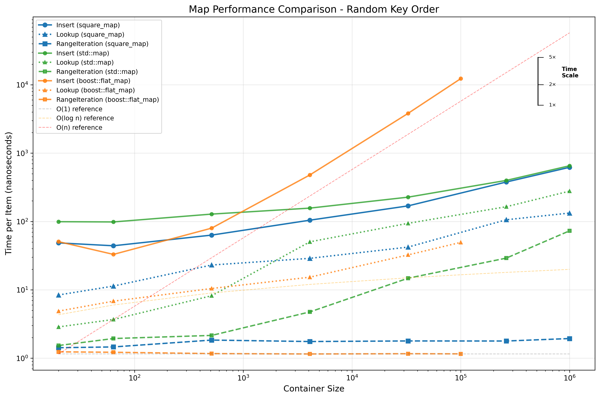

# SquareMap - A Memory-Efficient Ordered Map

## Summary

This document proposes a new general purpose data structure, named a square map, that implements an
ordered map interface. The square map balances the benefits of a binary search tree (tree map) and a
sorted vector (flat map), while avoiding their primary downsides. The appendix includes a C++
implementation of a square map and compares its performance against the std :: ordered_map and std
:: flat_map standard library implementations.

## Motivation

Ordered maps are often-used associative data structures containing comparable key-value pairs that
allow for efficient key range queries and iteration in key order in addition to point lookup of
keys. Improvements in these core components often result in improved overall application
performance.

The C++ standard library provides std :: ordered_map, which is generally implemented using a
balanced red-black tree. While good in terms of asymptotic complexity, for small key/value pairs the
overhead of dynamic memory allocation and internal pointers is significant, while for larger maps
locality of memory accesses becomes an issue.

Starting with C++23, the `std::flat_map` adapts a sequence container, such as `std::vector`, to
provide an alternative for `std::ordered_map` that allows for dense packing without space overhead
for pointers, or dynamic memory fragmentation. Iterating over key ranges avoids random memory
accesses, resulting in improved performance compared to a tree map. However, inserts have a
complexity that is linear in the size of the map, and as such flat maps are not suitable for
incrementally inserting large numbers of unordered items.

The square map combines the lookup and space efficiency of a flat map with an insert performance
close to that of a tree map. While ordinarily the performance of an algorithm with $\log n$ insert
complexity should dwarf the performance of a square map with $\sqrt{n}$ insert complexity for large
enough $n$, this is only true as long as both random accesses and sequential accesses have similar
cost. In reality, random accesses on large data structures are more expensive than sequential
accesses to the point that square maps can achieve similar asymptotical costs as tree maps. See the
Myth of RAM for an empirical and theoretical underpinning of this notion.

# Square Map Modification and Lookup

The square map is a refinement of the flat map, so revisit properties of that data structure first.
The flat map keeps elements in a sorted order, allowing lookup in a map of $n$ elements with $\log
n+O(1)$ complexity using binary search. Given a sequence container with $n$ elements $e_{0} ...
e_{n-1}$, where appending an element has a complexity that is amortized constant, inserting the
$n^{\text {th }}$ element in a flat map has a complexity that is linear in $n$, as we may have to
move up to $n$ existing items to keep the vector sorted. Building a map with $n$ items has a worst
case cost of $n^{2} / 2+O(n)$ element moves.

A square map is also an adaptation of a sequence container, but using two sorted ranges instead of
one. If there is a $j<n$ such that element $e_{j-1}>e_{j^{\prime}}$, element $e_{j}$ is the split
point and the first element of the right range, otherwise there is no split point and the right
range is empty. The left range has a size that is at least the square of the size of the right
range, hence the name square map. If there is a split point, the right range must contain the
largest element in the container and the left range must contain the smallest element. This property
simplifies iteration.

## Insertion

Until some minimal size $k$ is reached, insertion proceeds as for a flat map, and the second sorted
range remains empty. After reaching the size threshold, keep appending elements as long as they're
larger than the current largest (right-most) element. Otherwise, for a container of size $n$, insert
the next $\sqrt{n}$ items into the underlying vector keeping only these new elements sorted and
leaving the first $n$ elements untouched. Once the map reaches size $n+\sqrt{n}$, merge the two
ranges at cost $n+O(\sqrt{n})$. The amortized complexity of inserting each new item is:

$$
\frac{(\sqrt{n})^{2} / 2+O(\sqrt{n})+n+\sqrt{n}}{\sqrt{n}}=\frac{\sqrt{n}}{2}+\sqrt{n}+O(1)=O(\sqrt{n})
$$

After the merge step the square map is once more identical to a flat map, so by repeating the above
steps, inserting an arbitrary number of items $n$ has an amortized cost of $O(\sqrt{n})$. So, given
a flat map that inserts $n$ items at cost $O\left(n^{2}\right)$, we created a square map that
inserts $n$ items at cost $O(n \sqrt{n})$, for an amortized per element cost of $O(\sqrt{n})$.

## Deletion

Consider a key deleted when it is present in both sorted ranges. To delete a key that is present in
the left range, insert it in the right range. Otherwise, remove it from the right range. If the
right range is empty, deleting the largest key does not insert in the right range, but removes it
from the left range. As for insert, the complexity is $O(\sqrt{n})$.

## Lookup

Looking up items in a square map requires two binary searches, one in each sorted range. For a
square map of size $n$, the left range has at most size $n$ and the right has a size less than
$\sqrt{n}$. The complexity of lookup is therefore $\log _{2} n+\log _{2} \sqrt{n}+O(1)=1 \frac{1}{2}
\log _{2} n+O(1)$. While the complexity is still $O(\log n)$, the expected number of comparisons is
$50 \%$ larger than for a flat map. To reject or replace entries with a duplicate key, every insert
also incurs the cost of a lookup though this doesn't change the complexity of $O(\sqrt{k})$.

## Square Map Iteration

## Iterator Interface

Define an iterator type as an abstract data type that provides a reference to an element in a
container. A special iterator $i_{\text {end }}$ represents the past-the-end iterator for the
container. An iterator $i$ that compares equal to $i_{\text {end }}$ is exhausted and cannot be
dereferenced or incremented anymore. An iterator $i$ has the following operations:

| Operation         | Description |
|-------------------|-------------|
| $*i$              | Dereferences $i$, accessing the element it points to. This requires $i \neq i_{\text{end}}$. |
| ${\scriptsize{++}}i$             | Increments $i$ to point to the next element in the sequence. This requires $i \neq i_{\text{end}}$ as precondition, but yields $i = i_{\text{end}}$ when the iterator becomes exhausted. |
| $i_{j} < i_{k}$   | Returns true if and only if $i_{k} = i_{\text{end}} \wedge i_{j} \neq i_{\text{end}}$, or else $*i_{j}$ comes before $*i_{k}$.  Derive operations $>$, $=$, $\geq$, $\leq$, and $\neq$ as needed. |

Note that the "comes before" relationship is different for an ordered map than for a sequence. In an
ordered map $i_{j}<i_{k}$ implies $* i_{j}<* i_{k}$, but in a sequence it does not.

## Iterator Definition

An iterator for a square map needs to merge elements of both of its sorted ranges, and skip elements
present in both, as those represent deleted items. During iteration, it needs to swap between
referencing elements in either range. Represent an iterator $m$ of a square map as a pair of
iterators ( $s_{0}, s_{1}$ ) on its underlying sequence container.

| Valid Iterator State         | Description |
|-------------------------------|-------------|
| $\left(s_{0}, s_{1}\right)$, $s_{0}\ne_{\text{end}}$ and $s_{1}\ne_{\text{end}}$ | Possible states of iterator $m = \left(s_{0}, s_{1}\right)$, where $m$ is dereferenceable. |
| $s_{0} = s_{1} = s_{\text{end}}$ | This is the past-the-end iterator $m_{\text{end}}$. The iterator is valid, but may not be dereferenced or advanced. 

## Construction

Given a square map with empty right range and an iterator $s_{0}$ referencing an existing element
$e$ in the underlying sequence container and an iterator $s_{\text {last }}$ referencing the last
element in the sequence, construct iterator $m$ referencing $e$ as $m=\left(s_{0}, s_{\text {last
}}\right)$. If the right range is not empty, define $s_{1}$ as referencing the smallest element
greater than $e$ in the range not containing $e$, or $s_{0}=s_{\text {last }}$ if no such element
exists.

## Advancement

The table below details possible states of dereferenceable iterators. If $s_{0}$ is dereferenceable
that implies $s{1} is derefereneable. Advancing iterator $m = \left(s_{0}, s_{1}\right)$ starts with
advancing $s_0$: $s'_{0}=$ ++$s_0$. However, this intermediate state $(s'_0, s_1)$ is not
necessarily a valid iterator, as it may need adjustment in the case where $s'_0$ exhausted the left
range or references an erased element.

| Iterator  State                       | Description |
| ------------------------------------- | ----------------------------------------------- |
| $s_{0}=s{1}$                          | The left range of the container is exhausted (or empty) and the iterator no longer needs to merge. The advanced iterator is $m'=(s'_0,s'_0)$. |
| $s_0 \ne s_1$ and $*s'_{0} < *s_{1}$  | Valid iterator: $m'=(s'_0,s_1)$. |
| $s_0 \ne s_1$ and $*s'_{0} = *s_{1}$  | Here $s'_0$ references an erased element. Let $n$ be the smallest positive integer such that $*(s'_0 + n) \ne *(s_1 + n)$. Let $m'=(s'_0 + n, s_1 + n)$ if $*(s'_0 + n) < *(s_1 + n)$, and $m'=(s_1 + n,s'_0 + n)$ otherwise. |
| $s_0 \ne s_1$ and $*s'_{1} < *s_{0}$  | The iterator needs to swap sides and $m'=(s_1, s'_0)$.  |

The complexity of ${\scriptsize{++}}m$ is $O(1)$ if the map contains no delete elements, and $O(d)$
otherwise, where $d$ is the number of deleted elements. As $d<\sqrt{n}$ for any square map with $n$
elements, the worst case complexity is $O(\sqrt{n})$ in all circumstances. The complexity of a
series of $k$ iterator advancements is $O(k+\sqrt{d})$. The amortized cost of an iterator
advancement when iterating over all elements of a square map is still $O(1)$ regardless of the
presence of deleted elements.

## Comparison

As either iterator may be exhausted when comparing $m_{j}<m_{k}$, the comparison operation needs to
avoid dereferencing either before dealing with these edge cases. Let $m_{j}=\left(s_{j, 0^{\prime}}
s_{j, 1}\right)$ and $m_{k}=\left(s_{k, 0^{\prime}} s_{k, 1}\right)$. If either $s_{j, 0}=s_{j, 1}$
or $s_{k, 0}=s_{k, 1^{\prime}}$, that iterator is either pointing at the last element or is
exhausted. In both cases $m_{j}<m_{k}$ is equivalent to $s_{j, 0}<s_{k, 0}$. Otherwise, both
iterators are valid and $m_{j}<m_{k} \Leftrightarrow * m_{j}<* m_{k}$. As optimization consider
$m_{j}=m_{k} \Leftrightarrow m_{j, 0}=m_{k, 0}$.

# Experimental Results
The results in this section are for one specific instantiation of the map, as well as a specific set
of test scenarios and problem sizes that cannot be generalized. Whether the square map performs well
in your application depends on many factors, including the following:
* **caches**: the efficiency of this data structure depends on memory locality and the efficiency of
  caches to make random access of nearby items much cheaper than that of farther away items. If
  value sizes are such that caches are not effective, performance may be significantly worse than
  for other data structures, including `std::map`.
* **move costs**: this data structure depends on consecutive in-cache moves to be fast
* **value size**: the current implementation stores keys and values as pairs. If values are
  significantly larger than keys this will result in higher costs for comparisons and possibly lower
  performance.

# Performance Comparison
 While this graph is dense, it clearly illustrates the
most consequential performance properties of the square map. The vertical axis uses nanoseconds as
units, rather than move or comparison operations. This reflects the practical importance of time and
the acknowledgement that not all comparisons and moves are equal cost. The square map data structure
illustrates how a memory model where random access is O(1) regardless of the size of the data set
accessed is not realistic.

## Asymptotic Complexity
Comparing actual timing results with the reference plots using log-log scale, we can derive the
following:
* Random flat map inserts have $O(n)$ complexity both in theory and in practice. This is bad.
* Random flat map lookups have $O(\log n)$ complexity until about 32K elements and then gets much
  more expensive. This seems to be an effect of exceeding L2 cache size, where memory latencies
  start to dominate compute. For larger sizes the flat map and square map get closer, as the
  overhead of the square map with two sorted ranges compares to a flat map is mostly computational.
* Both flat map and square map have $O(1)$ complexity for range iteration, remarkably constant even
  for large $n$.
* Algorithic complexity of point lookups seems similar for all three data structures. For smallish
  maps below 1K elements, `std::map` is best, while above 10K elements the square map and flat map
  take over due to memory locality, but there's never more than a 4x difference regardless of $n$. 

### Inserts
There are three observations: two expected, and one remarkable. The flat map has a complexity that
exactly follows the $O(n)$ reference. The resulting build time of a map of $n$ elements is
proportional to $n^2$, and if ever you need a reminder of the awfullness of $n$-squared algorithms,
this is it. The reason the graphs don't show results beyond $10^5$ for the flat map is the amount of
time it added to producing the plot data. The $10^5$ point of the flat map is already 20x more
costly to run than the $10^6$ point of the other maps. This shows why you can't really afford any
$n$-squared code in practice: the costs are prohibitive even when $n$ gets just in the millions.

The other expected observation is for range iteration. Both the flat map and the squared map have
essentially constant $O(1)$ performance for iteration, while iteraton over a `std::map` shows costs
clearly exceeding $O(log n)$.

Still, one could expect the $\sqrt(n)$ for square maps to become similarly bad, as its complexity in
the graph would be a straight line, just as $O(n)$, but with a slope that is half. The experimental
results however show very similar insert behavior for both the `std::map` and the square map up to 1
million elements. The cost for inserting into a square map never exceeds that of inserting into a
`std::map` and Even the slope of the graph between the last two points is the same. This clearly
illustrates how not all memory accesses are equal, and designing algorithms to respect memory
locality can yield asymptotic benefits on the time scale that differ from those on the number of
operations. 
